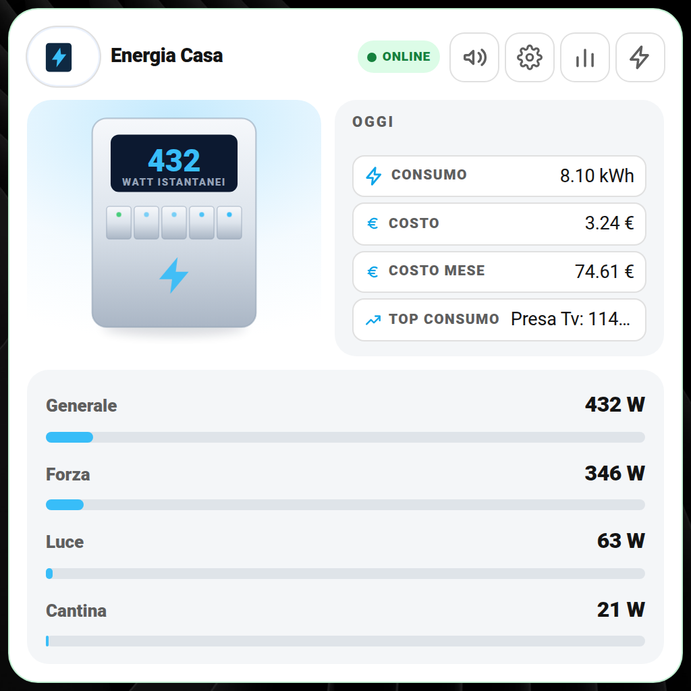
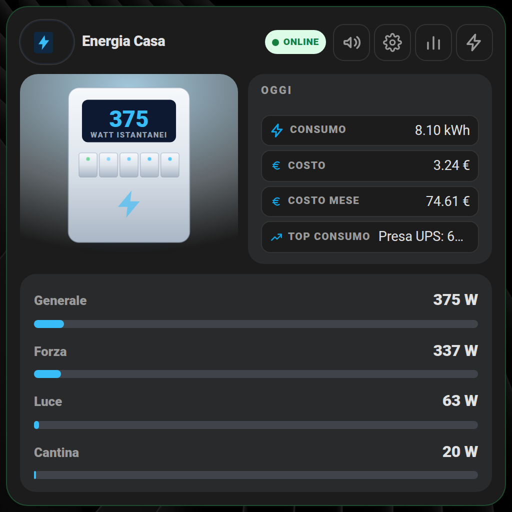
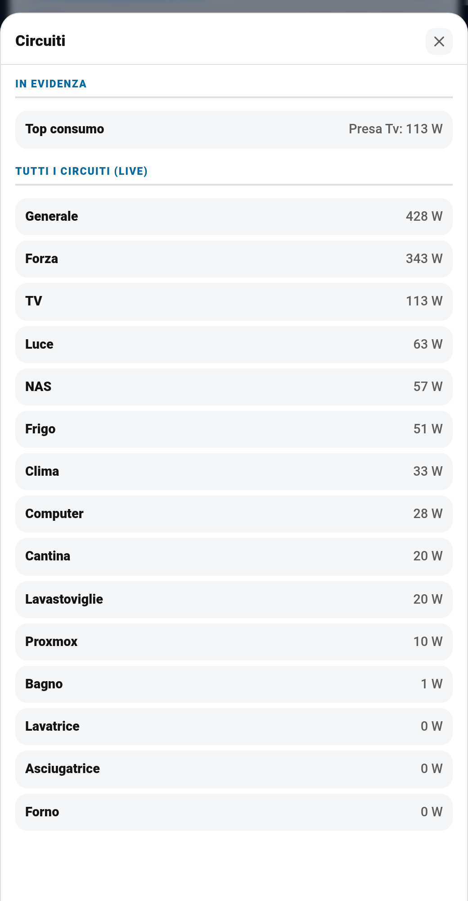
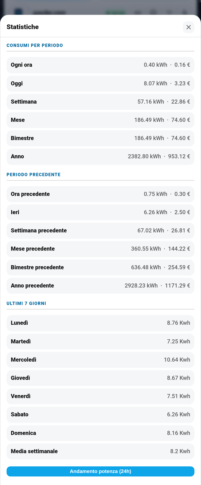
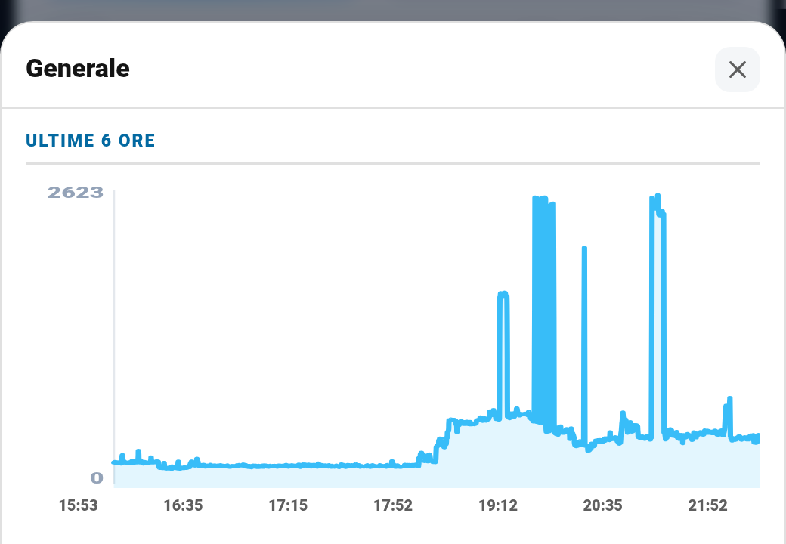
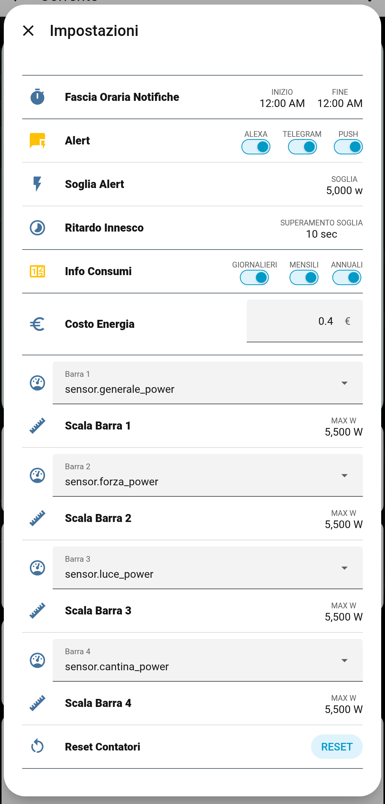

# ⚡ Controllo Energia Casa

Una card per **Home Assistant** che controlla l'energia di tutta la casa in un'unica vista: consumo istantaneo, 4 barre dei circuiti che scegli tu, costi per periodo, statistiche, avviso di soglia superata e notifiche (Push, Alexa, Telegram), ognuna con il suo interruttore.

Non richiede altre card: funziona da sola e legge/scrive solo tramite Home Assistant.

| Chiaro | Scuro |
|---|---|
|  |  |

## ✨ Cosa fa

- **Consumo istantaneo** in watt sul display della card e costo di oggi e del mese.
- **4 barre configurabili**: per ognuna scegli da un menu a tendina *quale sensore misurare* e *qual è il valore massimo* (la scala). Se non scegli nulla, la barra non compare.
- **Popup Circuiti**: tutti i tuoi circuiti e dispositivi, ordinati per consumo in tempo reale.
- **Popup Statistiche**: consumi e costi per ora, oggi, settimana, mese, bimestre, anno, con il confronto col periodo precedente, gli ultimi 7 giorni e la media settimanale. Grafico delle ultime 24 ore.
- **Grafico al clic** su ogni barra: le ultime 6 ore del circuito.
- **Soglia di allarme**: quando il consumo supera la soglia (con un ritardo che decidi tu) la card mostra un avviso e parte la notifica.
- **Notifiche separate**: Push sui telefoni, voce su Alexa e messaggio Telegram, ognuna con il suo interruttore (se spegni Telegram, Telegram non parte più). In più le notifiche di consumo giornaliero, mensile e annuale.
- **Impostazioni** raggiungibili dall'ingranaggio della card: soglia, ritardo, fascia oraria, costo del kWh, scale delle barre, interruttori e il reset dei contatori.

| Circuiti | Statistiche |
|---|---|
|  |  |

| Grafico di una barra | Impostazioni |
|---|---|
|  |  |

Le stesse schermate in tema scuro si trovano nella cartella [`docs/screenshot`](docs/screenshot).

## 🚀 Metodo veloce: usa il mio package originale

Il repository contiene **il mio package vero**, quello che uso a casa, ripulito solo dei dati privati: [`packages/controllo_energia_casa.yaml`](packages/controllo_energia_casa.yaml). Crea da solo tutti i contatori, i costi, gli interruttori, le notifiche e i menu delle barre, con gli stessi nomi che usa la card.

1. Copia `controllo-energia-casa.js` in `/config/www/` e aggiungilo alle risorse della dashboard.
2. Copia `packages/controllo_energia_casa.yaml` in `/config/packages/`.
3. **Cambia 4 cose** dentro il package (le trovi in testa al file): il tuo sensore di potenza totale, gli speaker Alexa, i telefoni e gli ID Telegram.
4. Riavvia Home Assistant e incolla la card di esempio.

Tutta la procedura, passo per passo: **[docs/installazione.md](docs/installazione.md)**.

## 📚 Guida

| Pagina | Contenuto |
|---|---|
| [Installazione](docs/installazione.md) | File, risorse, package, primo avvio e cosa impostare |
| [Configurazione della card](docs/configurazione.md) | Tutti i parametri, con un esempio completo |
| [Barre e scale](docs/barre-e-scale.md) | Menu a tendina delle entità, scala massima, barre nascoste |
| [Impostazioni](docs/impostazioni.md) | Il popup dell'ingranaggio: versione nativa e versione con `browser_mod` |
| [Notifiche e soglia](docs/notifiche.md) | Push, Alexa, Telegram, fascia oraria, consumi giornalieri/mensili/annuali |

## 🧩 Requisiti

- Home Assistant recente (la card è un modulo JavaScript, nessuna dipendenza).
- Un sensore che misura la **potenza totale della casa in watt**.
- Opzionale: `browser_mod` (solo per il popup Impostazioni "classico"), l'integrazione Telegram, Alexa Media Player, l'app Companion.

---

## ☕ Vuoi darmi una mano?

Il contenuto di questa pagina è completamente gratuito e lo scopo non è certamente fare soldi. Se vuoi darmi una mano per le spese e il tempo perso, ecco alcuni modi:

| | |
|---|---|
|  | Offrimi un caffè su Ko-fi |
|  | Una donazione libera su PayPal |
|  | Fai i tuoi acquisti Amazon partendo da questo link |

**Canali Telegram:**

| | |
|---|---|
|  | Notizie dedicate a Home Assistant |
|  | Offerte sui prodotti di domotica |

---

Sviluppato e curato da [Simonz82](https://t.me/Simonz82) · © 2026
