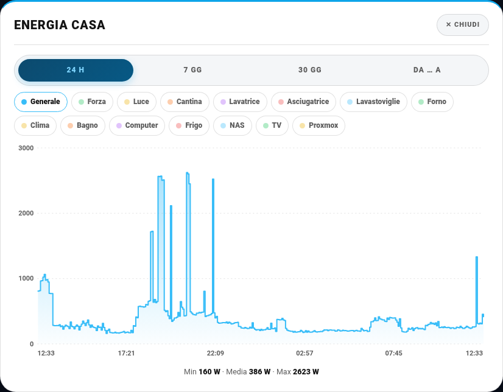
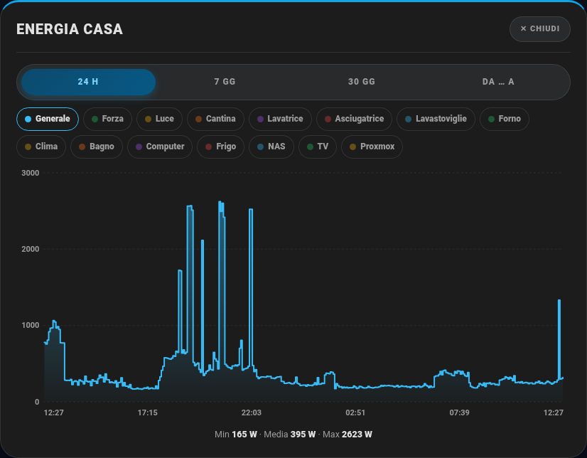

# 📈 Grafici: 24 h · 7 gg · 30 gg · da … a

Sulla card c'è un pulsante con una **linea che sale** (accanto a quello delle barrette "Statistiche"): apre il **grafico storico** dei circuiti, in quattro periodi:

| Periodo | Cosa mostra |
|---|---|
| **24 h** | le ultime 24 ore |
| **7 gg** | gli ultimi 7 giorni |
| **30 gg** | gli ultimi 30 giorni |
| **Da … a** | due date a scelta (con l'ora): scegli e premi **Applica** |

| Chiaro | Scuro |
|---|---|
|  |  |

- Parte dalla curva del **Generale**. In alto ci sono le **chip** dei circuiti (Forza, Luce, Cantina, ecc.): toccandone una la aggiungi al grafico, **sovrapposta** alle altre (tutte in Watt).
- Passando col mouse (o col dito) sul grafico compare una **linea guida** con il valore e l'ora; sotto ci sono **minimo, media e massimo** di ogni curva.
- Il grafico **si adatta allo schermo**: largo e alto su PC, più stretto su smartphone (la finestra sale dal basso).
- Si apre anche **toccando una barra** della card: mostra la curva di quel solo circuito.

| Curve sovrapposte |
|---|
|  |

## Da dove arrivano i dati

- **Fino a 8 giorni**: la **cronologia reale** dei sensori, tenendo il **picco** di ogni intervallo (se un forno assorbe 2 100 W per qualche minuto, nel grafico vedi 2 100 W, non una media).
- **Oltre 8 giorni** (30 gg o date lontane): le **statistiche a lungo termine** di Home Assistant, con il **massimo orario** per la potenza.
- La linea è **a gradini**: un valore resta valido fino al cambio successivo, come lo stato reale.

> **Consiglio:** la cronologia dettagliata dura quanto imposta il `recorder` (`purge_keep_days`, di solito 10 giorni). I sensori con `state_class: measurement` restano nelle statistiche per anni, quindi "Da … a" funziona anche indietro nel tempo. Non c'è nulla da configurare: il grafico usa gli stessi circuiti della card.
